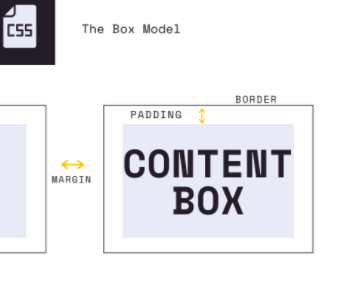
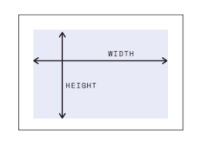
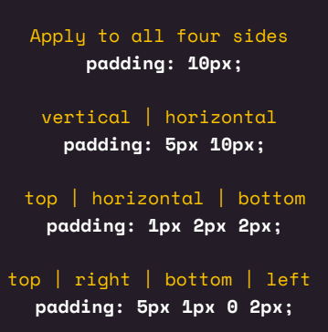

# CSS Box Model

- Crucial

  - width & hieght
  - broder
  - padding
  - margin
  - diplay property
  - units - percentage, EMS, & REMS

- Nice to have
  - Border Radius

## Box model

- core pieces
  - content box
  - padding
  - margin
  - border



### Content Box

- width
- hieght

  

### Border

- broder-width
- border-color
- border-style

```CSS
h1 {
    border-style: solid;
    border-color: pink;
    boder-width: 5px;
}
```

- border-width adds to size of box
- box-sizing: border-box;
  - subtracts to total size
- shorthand

  ```CSS
      h1 {
          border: 5px solid pink;
      }
  ```

  > **Note:** Shorthand in correct order: _width | style | color_

- border-radius
  - make rounded corners
  - can use percentages for circles

### Padding

Think of when shipping a box the content is inside then it is protected with padding like packing peanuts then there is the box

- padding is space between content and border
- individaul properties

  - padding-left
  - padding-right
  - padding-bottom
  - padding-top

- shorthad property

  - set all four at once or some combination

    

### Margin

think of same shipping model, how close shipping boxes are to one another is the the margin

- spacing on the outside
- same properties as padding
- body has margin and can be helpful to remove eary on

### Display Properties

1. Inline
   - width and height are ignored
   - margin and padding push elements away **horizontally** but not vertically
2. Block
   - break flow of a document
   - width, height, margin, and padding are respected
3. Inline-block
   - behaved like inline element with **exception**
     - width, height, margin, and padding are respected

- you can change inline/block behavior by changing display property

```CSS
h1 {
    display: inline;
}
```

> **Note:** this will make h1 (block element) behave like an inline element

## Units

- Relative
  - Are more common
  - Are **Relative** to some other value
  - issue with EMs is that with nested elements they can grow quickly
    - size is based on parent 
  - Common examples:
    - EM
      - example:
        - with font-size:
          - 1em equals the font-size of the parent
          - 2em equals twice the font-size of the parent
        - with other properties:
          - 1em is equal to the computed font size of the element itself
          - useful for changing based on font size - proportional changes
    - REM
      - Relative to the **root HTML element's** font-size
      - root font-size is 20px
        - 1 rem is always 20px
        - 2 rem is always 40px ...
        - can change only if you change html font size 
    - VH
    - VW
    - %
      - percentages are always relative to some other value
        - parent
        - itself
      - examples:
        - width: 50%
          - half the width of the parent
        - line-height: 50%
          - half the font size of the element itself
- Absolute
  - Common examples:
    - PX
    - PT
    - CM
    - IN
    - MM
